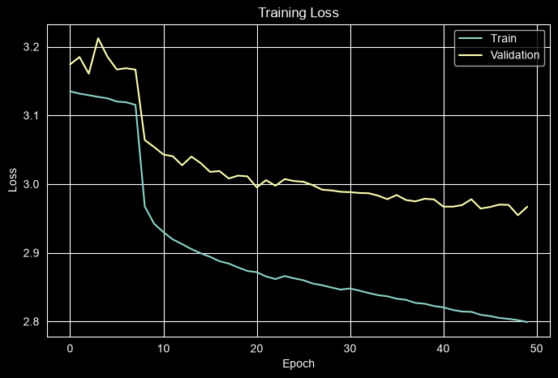
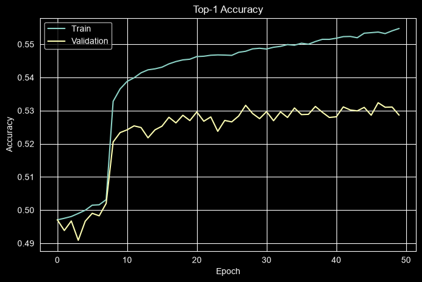
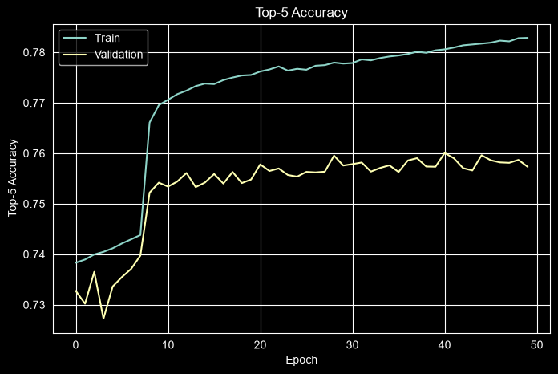
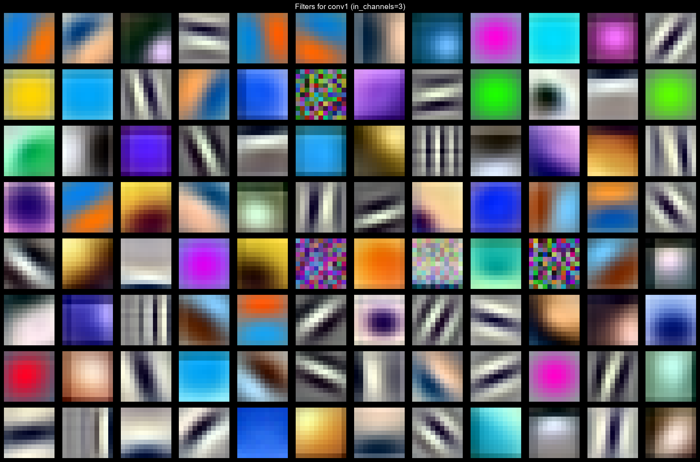
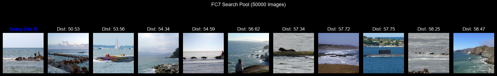
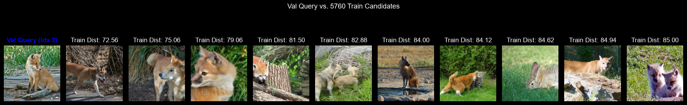
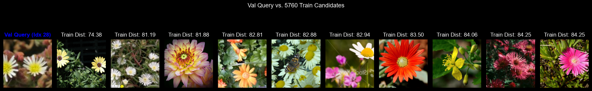
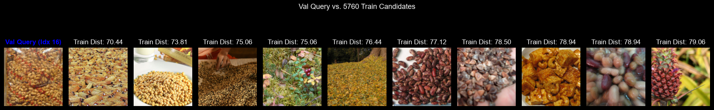
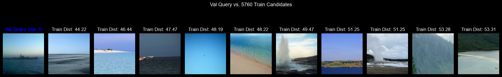
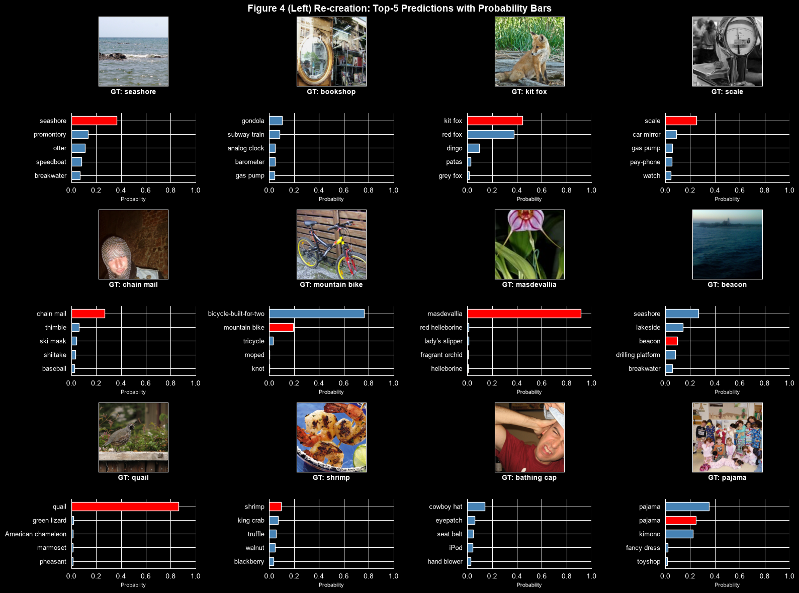

ImageNet Classification with Deep 
Convolutional Neural Networks
By Alex Krizhevsky, Ilya Sutskever, and Geoffrey E. Hinton

Year : 2012

Link : https://proceedings.neurips.cc/paper_files/paper/2012/file/c399862d3b9d6b76c8436e924a68c45b-Paper.pdf

Dataset Link : https://image-net.org/download-images.php (Might need Org Email signup)

All codes are executed using .ipynb in local OMEN laptop at CPU/RTX 5050 GPU.

Notes & Observations : 
1. Model Arch, Layers, Hyperparameters, etc are all replicated exactly as same as described in paper.
2. AlexNet.ipynb contains all code from loading dataset to data augmentation to model arch to model training & evaluation
3. Model was trained for 90 Epochs (as in paper) and used SGD with 0.01 as Initial Learning Rate and reduced by factor 10 when Validation loss platued over 5 Epochs (as in paper), took ~40 Hrs on RTX 5050
4. Model has 62,378,350 trainable parameters (small in today's standards) and Training images contains ~1.2 Million images of 256x256 Resolution of 1000 Classes (Large dataset, ~150GB)
5. Data Augmentation : We did Simple Transformation as specified in paper but not PCA Color jittering.
6. Model Arch : We use Dropout(0.5) for Overfitting Issue, ReLU for Faster Convergence, LRN as in paper.
7. I Wish to do ablation study, With and Without Dropout and Various values in Dropout, Relu vs Tanh vs Others, Without LRN and With Batch/Layer Norm Etc.
   But Most of the study already done within this paper and else were and my time and computation isnt available much to do so.
8. ReLU vs TanH and With LRN and Without LRN on 4 Layer CNN on CIFAR-10 is done (which is also specified in the paper)
9. Upon Training 90 Epochs, We get 55.47% as Training Accuracy, 2.799 as Training Loss, 78.28 % as Top-5 Training Accuracy
   And 52.86% as Validation Accuracy, 2.96 as Validation Loss and 75.73% as Top-5 validation Loss. 
10. I will add related plots below, We dint get same as what was specified in paper.
    Paper says 37.5% and 17.0% on top-1 and top-5 error rates on test data, which is 62.5% Accuracy and 83% Top-5 Accuracy on Test Data.
    We should had got Far more on Validation set. 
11. Few i can think of as what happend. 
    >A. We dint use PCA Color Jitters, but paper says they only improved 1%
    
    >B. Multi-GPU Training and Cross Connection, Paper says they improved 1.7%

    >C. LR Scheduled too soon, maybe.

    But Anyway, This is good enough for now.

12. Training Loss vs Validation Loss for last 50 Epochs

13. Training Accuracy vs Validation Accuracy for last 50 Epochs

14. Top-5 Training Accuracy vs Top-5 Validation Accuracy for last 50 Epochs

15. We dont have TestData as their Labels isnt available, We evaluate model on validation set, as anyway we dint hypertune our model.
16. Most of my Time took at Downloading 150GB Train Set and Optimizing dataLoader so GPU wouldnt wait for CPU on it, as We have data augmentation technique, cpu handles those operation on each 1.2 million images while training, optimization was required.
    Then Nearly 40Hrs on Training the Model, Each epoch took 25 Min on Average.
    Total, it took 20 Days to complete replication and reproduction of many results from paper.
17. Visualized the Kernels of Various Conv Layers, here is !st CNN Layer Kernels 
18. Visualized the Feature Map for sample Image, can be found in Ipynb output.
19. Recreated the Nearest Neighbor of Similar Images search 
    
20. Finally Model Result Examples : 
