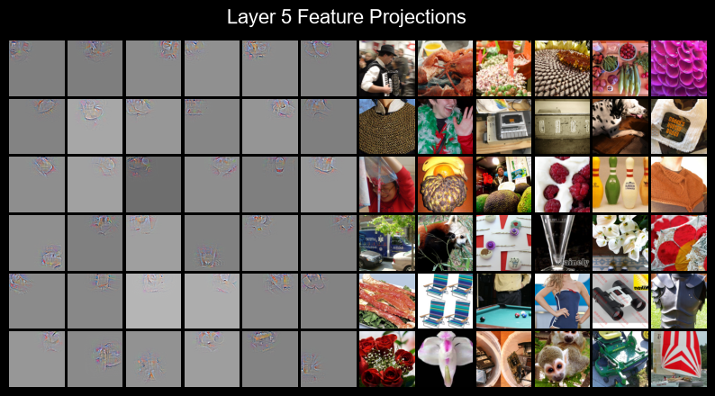
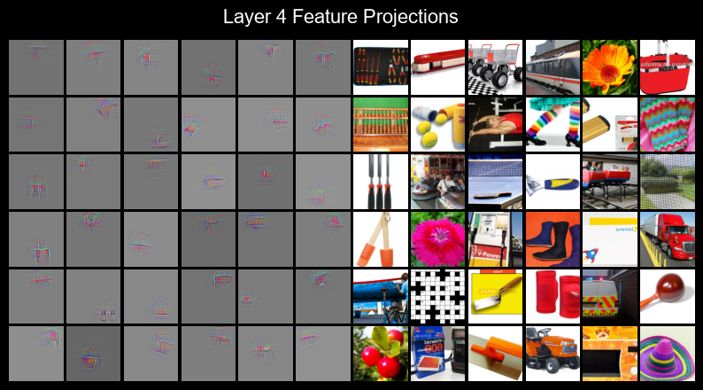
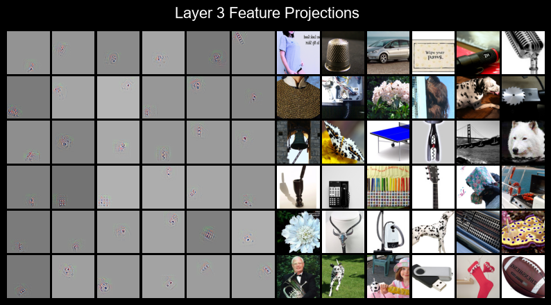
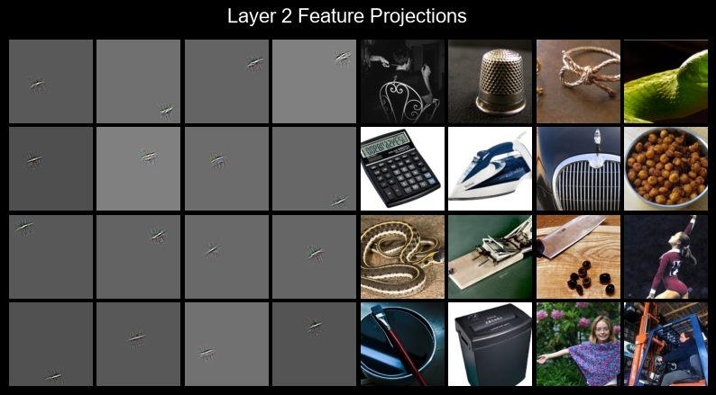
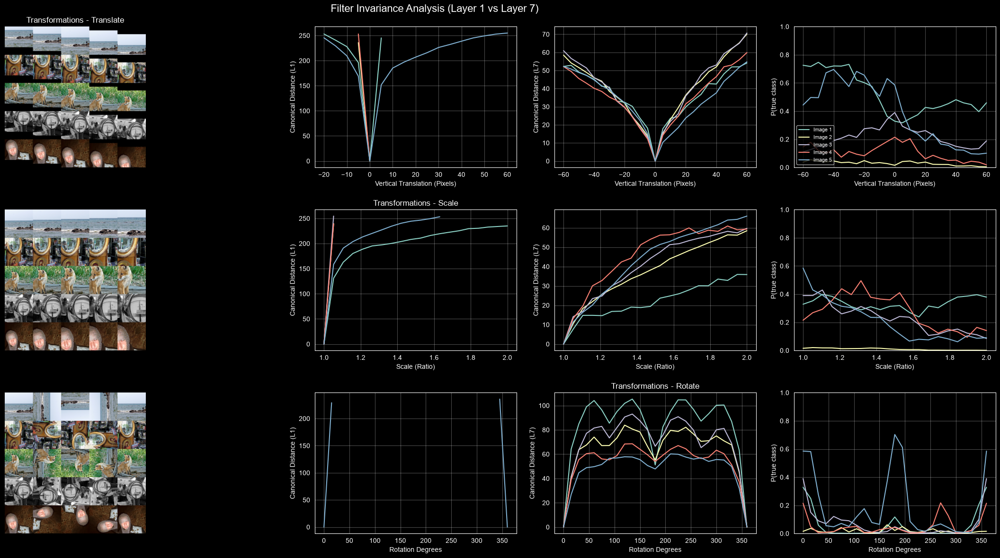
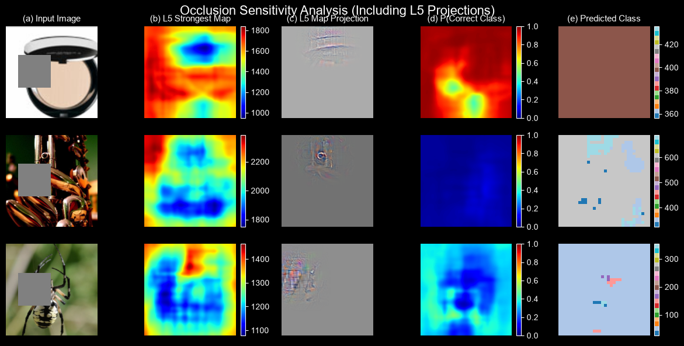
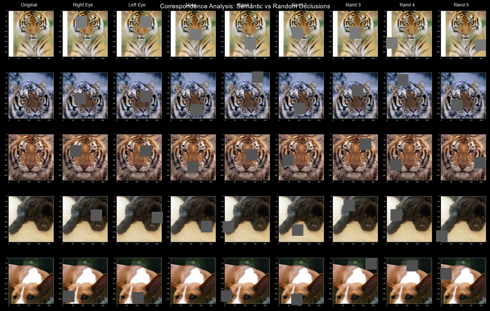
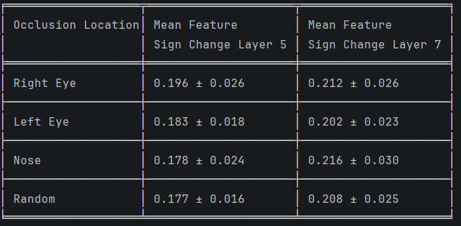

Visualizing and Understanding Convolutional Networks
by Matthew D. Zeiler and Rob Fergus

Year : 2013

Link : https://arxiv.org/pdf/1311.2901v1

Dataset : Imagenet 2010 (https://image-net.org/download-images.php (Might need Org Email signup))

All codes are executed using .ipynb in local OMEN laptop at CPU or RTX 5050 GPU

Notes & Observations :
1. We dint train separate ZFNet. We reused Trained AlexNet for Visualization

2. ZFNet.ipynb contains all code from loading dataset to data augmentation to model arch to model training & evaluation.

3. Filter Visualization :

4. Filter Invariance : 

5. Occlusion Sensitivity : 

6. Correspondence Analysis : 

